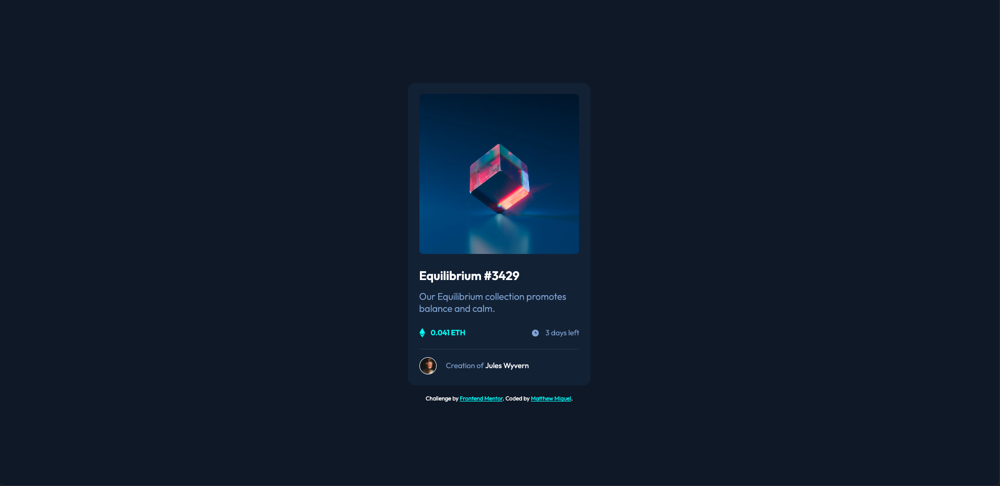

# Frontend Mentor - NFT preview card component solution

This is a solution to the [NFT preview card component challenge on Frontend Mentor](https://www.frontendmentor.io/challenges/nft-preview-card-component-SbdUL_w0U). Frontend Mentor challenges help you improve your coding skills by building realistic projects. 

## Table of contents

- [Overview](#overview)
  - [The challenge](#the-challenge)
  - [Screenshot](#screenshot)
  - [Links](#links)
- [My process](#my-process)
  - [Built with](#built-with)
  - [What I learned](#what-i-learned)
  - [Continued development](#continued-development)
  - [Useful resources](#useful-resources)
- [Author](#author)
- [Acknowledgments](#acknowledgments)


## Overview

### The challenge

Users should be able to:

- View the optimal layout depending on their device's screen size
- See hover states for interactive elements

### Screenshot



### Links

- Solution URL: [Add solution URL here](https://your-solution-url.com)
- Live Site URL: [Add live site URL here](https://your-live-site-url.com)

## My process

### Built with

- Semantic HTML5 markup
- CSS float and positioning

### What I learned

Learned more about to overlay an images on hover. 

```html
<section class="mainimg">
      
      <section class="overlay">
        
</section>
```

```css
.overlay{
  position: absolute;
  left: 42%;
  right: 50%;
  top: 19.5%;
  bottom: 40%;
  width: 17rem;
  height: 17rem;
  border-radius: 0.4rem;
  background-color: rgb(0, 255, 247,50%);
  opacity: 0;
}

.viewicon{
    position: absolute;
    left: 50%;
    top: 50%;
    transform: translate(-50%,-50%);  
}

.overlay:hover {
    cursor: pointer;
    opacity: 1;
}
```

### Continued development

I want to keep working on positioning elements and completing challenges faster.

### Useful resources

- [Overlaying Images](https://www.w3schools.com/howto/howto_css_image_overlay_icon.asp) - This helped with how to overlay images


## Author

- Frontend Mentor - [@MattJM1007](https://www.frontendmentor.io/profile/MattJM1007)

